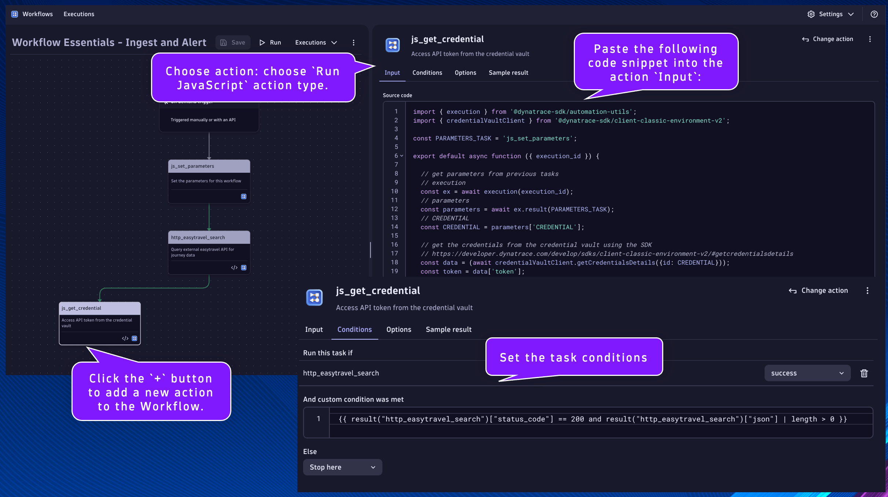
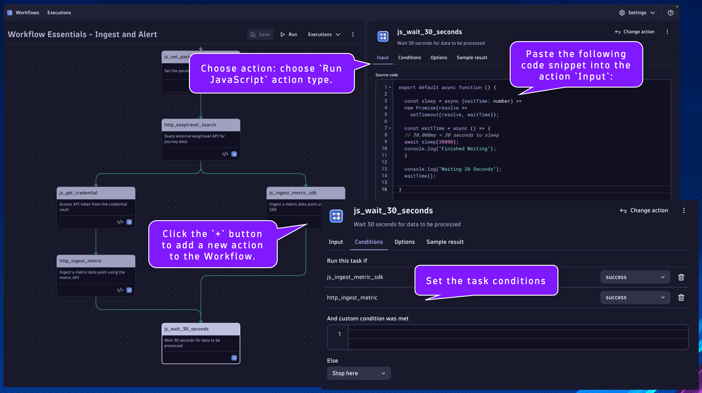

--8<-- "snippets/send-bizevent/04_ingest_and_alert.js"

# Ingest and Alert

Goal: Retrieve data from an external system and ingest it as a metric.  If the value crosses a configured threshold, then generate an event/alert.

- Credential Vault
    * Access an API token from the Credential Vault using the Dynatrace SDK
- Metric Ingest
    * Retrieve data from an external system using HTTP GET
    * Ingest retrieved data point using the Dynatrace API with API token (not optimal)
    * Ingest retrieved data point using the Dynatrace SDK (optimal)
- Event Ingest
    * Query ingested metric data point using DQL
    * Evaluate metric value against a threshold
    * If the threshold is breached, generate an event using the Dynatrace SDK

## Set Workflow Parameters

Begin by creating a new Workflow in the Workflows App within your Dynatrace environment.

*Remember to save progress often!*

Select a trigger: choose `On demand trigger`


Click the `+` button to add a new action to the Workflow.


Choose action: choose `Run JavaScript` action type.


---
### `js_set_parameters`
Name:
```text
js_set_parameters
```
Description:
```text
Set the parameters for this workflow
```

This will be the task/action that defines the parameters/variables that will be used by subsequent tasks and returns them in the result.  By setting the parameters as nested attribute key:value pairs within a single variable, as additional parameters are needed they can easily be added without modifying any other code.

Set the task name and description respectively.

Paste the following code snippet into the action `Input`:
```
export default async function () {

  let PARAMETERS = {

    // EASYTRAVEL_URL - the URL to the easytravel rest API to search for journeys and receive JSON payload
    EASYTRAVEL_URL: "http://aeb26f2507d934338baf67206067edef-612923892.us-east-1.elb.amazonaws.com/easytravel/rest/journeys/?match=Dallas&from=&to=", // i.e. EASYTRAVEL_URL: "http://aeb26f2507d934338baf67206067edef-612923892.us-east-1.elb.amazonaws.com/easytravel/rest/journeys/?match=Dallas&from=&to="
  
    // METRIC - the unique metric id to ingest a data point for the easytravel journey amount
    METRIC: "custom.workflow_essentials.easytravel.journey_amount", // i.e. METRIC: "custom.workflow_essentials.easytravel.journey_amount"
  
    // CREDENTIAL - the credential vault entity ID that holds the Dynatrace API token value with metrics.ingest scope
    CREDENTIAL: "", // i.e. CREDENTIAL: "CREDENTIALS_VAULT-123ABCF8F36FD"

    // INGEST_URL - the URL of the dynatrace metric ingest API endpoint
    INGEST_URL: "https://<tenant-id>.live.dynatrace.com/api/v2/metrics/ingest", // i.e. INGEST_URL: "https://abc123.live.dynatrace.com/api/v2/metrics/ingest"

    // THRESHOLD - the threshold amount to trigger an alert event
    THRESHOLD: 500, // i.e. THRESHOLD: 500; trigger an alert event if the average journey amount is above 500.00
    
  }
  
  return PARAMETERS;
}
```

Set the value of the missing variables:

- CREDENTIAL:
    * Use the credential vault entry ID from the Workflow Essentials - Config Generator workflow execution
- INGEST_URL:
    * Replace `<tenant-id>` with your Dynatrace environment ID, i.e. `abc123`


## Query External Data

### `http_easytravel_search`
Name:
```text
http_easytravel_search
```
Description:
```text
Query external easytravel API for journey data
```

This will be the task/action that queries external data from an api endpoint that contains our metric data point.

Locate the `js_set_parameters` task.

Click the `+` button to add a new action to the Workflow.

Choose action: choose `HTTP Request` action type.

Set the task name and description respectively.

Configure the HTTP Request action `Input`:

Method:
```
GET
```

URL:
```
{{ result("js_set_parameters")['EASYTRAVEL_URL'] }}
```

Headers:
```
accept  application/json
```

Error Handling:
```
Fail on certain HTTP response codes [Enabled]
```

HTTP error codes:
```
400-599
```

Click on the task's `Conditions` tab.  Set the `Run this task if`: `js_set_parameters` is `success`

Additionally, we only want this task to run if the `EASYTRAVEL_URL` parameter is defined in the previous task.  We can access the result using a Jinja expression:
```js
1. {{ result("task_name") }}
2. {{ result("task_name")['result_attribute_name'] }}
3. {{ result("task_name")['result_attribute_name'] condition expression }}
```

[Expression Reference Documentation](https://docs.dynatrace.com/docs/platform-modules/automations/workflows/reference)

Set the `And custom condition was met`:
```
{{ result("js_set_parameters")['EASYTRAVEL_URL'] is defined }}
```


Run the workflow and validate the results


## Credential Vault with Dynatrace SDK

### `js_get_credential`
Name:
```text
js_get_credential
```
Description:
```text
Access API token from the credential vault
```

This will be the task/action that uses the Dynatrace SDK to retrieve a credential from the vault.  Confidential data and parameters should be stored in the credential vault and not statically defined in the code.

Locate the `http_easytravel_search` task.

Click the `+` button to add a new action to the Workflow.

Choose action: choose `Run JavaScript` action type.

Set the task name and description respectively.

Paste the following code snippet into the action `Input`:
```
import { execution } from '@dynatrace-sdk/automation-utils';
import { credentialVaultClient } from '@dynatrace-sdk/client-classic-environment-v2';

const PARAMETERS_TASK = 'js_set_parameters';

export default async function ({ execution_id }) {

  // get parameters from previous tasks
  // execution
  const ex = await execution(execution_id);
  // parameters
  const parameters = await ex.result(PARAMETERS_TASK);
  // CREDENTIAL
  const CREDENTIAL = parameters['CREDENTIAL'];

  // get the credentials from the credential vault using the SDK
  // https://developer.dynatrace.com/develop/sdks/client-classic-environment-v2/#getcredentialsdetails
  const data = (await credentialVaultClient.getCredentialsDetails({id: CREDENTIAL}));
  const token = data['token'];
  
  return { token: token };
}
```

Click on the task's `Conditions` tab.  Set the `Run this task if`: `http_easytravel_search` is `success`

Additionally, we only want this task to run if the `status_code` is `200` and the response is not empty in the previous task.

Set the `And custom condition was met`:
```
{{ result("http_easytravel_search")["status_code"] == 200 and result("http_easytravel_search")["json"] | length > 0 }}
```



## Metric Ingest - Dynatrace API with Token

### `http_ingest_metric`
Name:
```text
http_ingest_metric
```
Description:
```text
Ingest a metric data point using the metric API
```

This will be the task/action that ingests a metric data point from the previous task using an HTTP call to the metric ingest API with a token from the credential vault.

Locate the `js_get_credential` task.

Click the `+` button to add a new action to the Workflow.

Choose action: choose `HTTP Request` action type.

Set the task name and description respectively.

Configure the HTTP Request action `Input`:

Method:
```
POST
```

URL:
```
{{ result("js_set_parameters")['INGEST_URL'] }}
```

Payload:
```
{{ result("js_set_parameters")["METRIC"] }},id={{ result("http_easytravel_search")["json"][0]["id"] }},destination={{ result("http_easytravel_search")["json"][0]["destination"] }} {{ result("http_easytravel_search")["json"][0]["amount"] }}
```

Headers:
```
Content-Type  text/plain
Authorization   Api-Token {{ result("js_get_credential")["token"] }}
```

Error Handling:
```
Fail on certain HTTP response codes [Enabled]
```

HTTP error codes:
```
400-599
```

Click on the task's `Conditions` tab.  Set the `Run this task if`: `js_get_credential` is `success`

Additionally, we only want this task to run if the `token` parameter is defined in the previous task.

Set the `And custom condition was met`:
```
{{ result("js_get_credential")['token'] is defined }}
```


Run the workflow and validate the results


## Metric Ingest - Dynatrace SDK

### `js_ingest_metric_sdk`
Name:
```text
js_ingest_metric_sdk
```
Description:
```text
Ingest a metric data point using the SDK
```

This will be the task/action that uses the Dynatrace SDK to ingest a metric data point.  The SDK makes it significantly easier to perform this function than using the API and authorization token.

Locate the `http_easytravel_search` task.

Click the `+` button to add a new action to the Workflow.

Choose action: choose `Run JavaScript` action type.

Set the task name and description respectively.

Paste the following code snippet into the action `Input`:
```
import { execution } from '@dynatrace-sdk/automation-utils';
import { metricsClient } from "@dynatrace-sdk/client-classic-environment-v2";

const PARAMETERS_TASK = 'js_set_parameters';
const SEARCH_TASK = 'http_easytravel_search';

export default async function ({ execution_id }) {

  // get parameters from previous tasks
  // execution
  const ex = await execution(execution_id);
  // parameters
  const parameters = await ex.result(PARAMETERS_TASK);
  const METRIC = parameters['METRIC'];
  // previous results
  const search_results = await ex.result(SEARCH_TASK);
  const id = search_results['json'][0]['id'];
  const amount = search_results['json'][0]['amount'];
  const destination = search_results['json'][0]['destination'];

  // build the line_protocol string to ingest the metric data point
  const line_protocol = METRIC + ',id=' + id + ',destination=' + destination + ' ' + amount;
  // (optional) log the line_protocol value
  console.log(line_protocol);
  // ingest the metric data point using the SDK
  // https://developer.dynatrace.com/develop/sdks/client-classic-environment-v2/#ingest-1
  const data = await metricsClient.ingest({
    body: line_protocol,
  });
  
  return { data: data };
}
```

Click on the task's `Conditions` tab.  Set the `Run this task if`: `http_easytravel_search` is `success`

Additionally, we only want this task to run if the `status_code` is `200` and the response is not empty in the previous task.

Set the `And custom condition was met`:
```
{{ result("http_easytravel_search")["status_code"] == 200 and result("http_easytravel_search")["json"] | length > 0 }}
```


Run the workflow and validate the results


## Event Ingest - Dynatrace SDK

### `js_wait_30_seconds`
Name:
```text
js_wait_30_seconds
```
Description:
```text
Wait 30 seconds for data to be processed
```

This will be the task/action that pauses workflow execution for 30 seconds with a timed wait using JS code.  This method can be useful when you need to pause task execution within your JS code task.  Additionally, you can configure any task to wait up to 60 seconds in the `Options` tab.

When data is ingested into the Dynatrace platform, it may not be available immediately.  To avoid a query from returning an empty result set, we'll wait 30 seconds for the data to be processed before continuing.

Locate the `http_ingest_metric` task.

Click the `+` button to add a new action to the Workflow.

Choose action: choose `Run JavaScript` action type.

Set the task name and description respectively.

Locate the `js_ingest_metric_sdk` task.

Click *and hold* the `+` button, then *drag* to connect this task to the `js_wait_30_seconds` task.

Paste the following code snippet into the action `Input`:
```
export default async function () {

  const sleep = async (waitTime: number) =>
  new Promise(resolve =>
    setTimeout(resolve, waitTime));
  
  const waitTime = async () => {
  // 30,000ms = 30 seconds to sleep
  await sleep(30000);
  console.log("Finished Waiting");
  }

  console.log("Waiting 30 Seconds");
  waitTime();
  
}
```

Click on the task's `Conditions` tab.  Set the `Run this task if`: `js_ingest_metric_sdk` is `success` and `http_ingest_metric` is `success`



---
### `js_dql_query_alert`
Name:
```text
js_dql_query_alert
```
Description:
```text
Query metric data point and generate an alert via SDK
```

This will be the task/action that uses the Dynatrace SDK to execute a DQL query to retrieve a metric data point and trigger an alert event if the value crosses a threshold.  Using the Dynatrace SDK is an alternative method for running a DQL query within workflows.  When a Davis problem event is triggered using the Dynatrace SDK within workflows, the event is stored in Grail and the problem is available in the Problems app.

Locate the `js_wait_30_seconds` task.

Click the `+` button to add a new action to the Workflow.

Choose action: choose `Run JavaScript` action type.

Paste the following code snippet into the action `Input`:
```
import { execution } from '@dynatrace-sdk/automation-utils';
import { queryExecutionClient } from "@dynatrace-sdk/client-query";
import { eventsClient, EventIngestEventType } from "@dynatrace-sdk/client-classic-environment-v2";

const PARAMETERS_TASK = 'js_set_parameters';
const SEARCH_TASK = 'http_easytravel_search';

export default async function ({ execution_id }) {

  // get parameters from previous tasks
  // execution
  const ex = await execution(execution_id);
  // parameters
  const parameters = await ex.result(PARAMETERS_TASK);
  const METRIC = parameters['METRIC'];
  const THRESHOLD = parameters['THRESHOLD'];
  // previous results
  const search_results = await ex.result(SEARCH_TASK);
  const destination = search_results['json'][0]['destination'];
  
  // build the DQL query for the metric
  // query the metric value for the last 5 minutes
  // https://developer.dynatrace.com/develop/sdks/client-query/#queryexecute
  const timeout = 60;
  const query = 'timeseries journey_amount = avg(' + METRIC + '), by: {destination}, from: now()-5m\
                  | filter destination == "' + destination + '"\
                  | summarize avg_amount = avg(arrayAvg(journey_amount))';
  
  const query_response = await queryExecutionClient.queryExecute({ body: { query, requestTimeoutMilliseconds: timeout * 1000, fetchTimeoutSeconds: timeout  } });

  // check if the query result is empty (unexpectedly)
  if(query_response.result.records.length == 0) {
    console.log("Query returned an empty result unexpectedly!");
    return query_response.result;
  }

  // capture the average journey amount from query response
  const avg_amount = parseFloat(query_response.result.records[0]['avg_amount']);

  // check if the avg amount value is above the threshold parameter, if true then raise alert event
  if(avg_amount > THRESHOLD) {

    // https://developer.dynatrace.com/develop/sdks/client-classic-environment-v2/#createevent
    const event_response = await eventsClient.createEvent({
      // https://developer.dynatrace.com/develop/sdks/client-classic-environment-v2/#eventingest
      body : {
        eventType: EventIngestEventType.CustomAlert, // https://developer.dynatrace.com/develop/sdks/client-classic-environment-v2/#eventingesteventtype
        title: 'EasyTravel Journey Amount [ ' + avg_amount + ' ]',
        timeout: 5,
        properties: {
          'amount': avg_amount,
          'threshold' : THRESHOLD,
        }
      }
    });
    
    // validate that the alert event was created, return the correlationId and details
    if(event_response.eventIngestResults[0].status == "OK") {
      return {
        amount: avg_amount,
        threshold: THRESHOLD,
        correlationId: event_response.eventIngestResults[0].correlationId
      }
    } else {
      return {
        amount: avg_amount,
        threshold: THRESHOLD,
        correlationId: "ERROR"
      }
    }
  }
}
```

Click on the task's `Conditions` tab.  Set the `Run this task if`: `js_wait_30_seconds` is `success`


Run the workflow and validate the results


After validating that the workflow execution was successful and the `js_dql_query_alert` result has a populated `correlationId` value, open the Problems (or Problems (Classic)) app and view the open problem alert.


## Continue

In the next section, we'll set up third party integration.

<div class="grid cards" markdown>
- [Continue to Third Party Integration:octicons-arrow-right-24:](05_third_party_integration.md)
</div>
