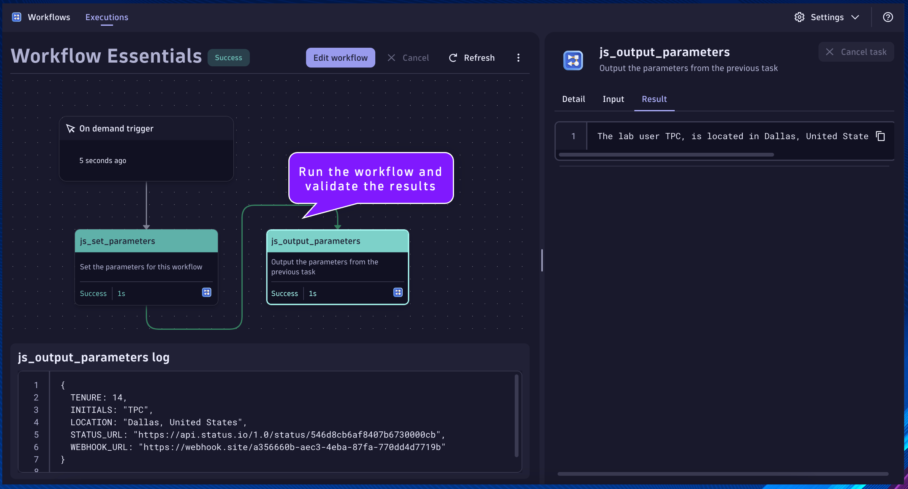

--8<-- "snippets/send-bizevent/2-getting-started.js"

## Workflow Essentials

Goal: Utilize essential Workflow techniques applicable to most use cases.

- Parameters and Task Results
    * Parameter Task – define parameters/variables that will be used by subsequent tasks
    * Parameter Task Output – return parameters for subsequent tasks
    * Accessing Parameter Task Results – access the parameters from result of the task
- Fetch API
    * HTTP GET  (Dynatrace Status.io) – bring external data into Dynatrace workflows
    * HTTP POST  (Webhook.Site) – send data to external systems from Dynatrace workflows
- Looping Tasks
    * DQL Query – execute a DQL query that returns multiple records/rows
    * Looping Over Results – perform logic against each DQL record/row

## Parameters and Task Results

Begin by creating a new Workflow in the Workflows App within your Dynatrace environment.

*Remember to save progress often!*

Select a trigger: choose `On demand trigger`


Click the `+` button to add a new action to the Workflow.


Choose action: choose `Run JavaScript` action type.


#### `js_set_parameters`

Name:
```text
js_set_parameters
```
Description:
```text
Set the parameters for this workflow
```

This will be the task/action that defines the parameters/variables that will be used by subsequent tasks and returns them in the result.  By setting the parameters as nested attribute key:value pairs within a single variable, as additional parameters are needed they can easily be added without modifying any other code.

Set the task name and description respectively.

Paste the following code snippet into the action `Input`:

```
export default async function () {

  let PARAMETERS = {

    // INITIALS - the initials of the user for this lab
    INITIALS: "", // i.e. INITIALS: "TPC"; the intials of the user for this lab are TPC
  
    // LOCATION - the city and country of the user for this lab
    LOCATION: "", // i.e. LOCATION: "Dallas, United States";
  
    // TENURE - the number of years of tenure of the user for this lab
    TENURE: ##, // i.e. TENURE: 14; the user for this lab has 14 years of tenure

    // STATUS_URL - the URL of the dynatrace status.io API
    STATUS_URL: "https://api.status.io/1.0/status/546d8cb6af8407b6730000cb", // i.e. STATUS_URL: "https://api.status.io/1.0/status/546d8cb6af8407b6730000cb"

    // WEBHOOK_URL- the URL of the webhook.site unique endpoint
    WEBHOOK_URL: "", // i.e. WEBHOOK_URL: "https://webhook.site/18637ec8-fcf9-43ec-86bf-993626982c6c"
  
  }
  
  return PARAMETERS;
}
```

Set the value of the missing variables:
- INITIALS: your initials
- LOCATION: your location
- TENURE: the number of years you've been with the company
- WEBHOOK_URL:
    * Navigate in your incognito browser window to https://webhook.site/ and copy your unique URL
      * The unique URL is located at the top of the page, not in your browser's address bar


#### `js_output_parameters`

Name:
```text
js_output_parameters
```
Description:
```text
Output the parameters from the previous task
```

This will be the task/action that accesses the parameters from the previous tasks results.  This will demonstrate how to do this within JS code.

Click the `+` button to add a new action to the Workflow.

Choose action: choose `Run JavaScript` action type.

Set the task name and description respectively.

Paste the following code snippet into the action `Input`:
```
import { execution } from '@dynatrace-sdk/automation-utils';

const PARAMETERS_TASK = 'js_set_parameters';

export default async function ({ execution_id }) {
  
  // get parameters from previous tasks
  // execution
  const ex = await execution(execution_id);
  // parameters
  const parameters = await ex.result(PARAMETERS_TASK);

  // log the parameters
  console.log(parameters);

  // declare new variables to easily access the parameters within this task
  const INITIALS = parameters['INITIALS'];
  const LOCATION = parameters['LOCATION'];
  const TENURE = parameters['TENURE'];

  // return a string that contains the parameters
  return "The lab user " + INITIALS + ", is located in " + LOCATION + ".  They have " + TENURE + " years of tenure.";
  
}
```

Click on the task's `Conditions` tab.  Set the `Run this task if`: `js_set_parameters` is `success`


Run the workflow and validate the results



## Fetch API

#### `js_fetch_status_io`

Name:
```text
js_fetch_status_io
```
Description:
```text
Read dynatrace status.io using fetch api
```

This will be the task/action that uses the `fetch()` api to make an HTTP call to the Dynatrace status.io api.  This will demonstrate how to make HTTP calls using JS code, in order to bring in external data.

Locate the `js_set_parameters` task.

Click the `+` button to add a new action to the Workflow.

Choose action: choose `Run JavaScript` action type.

Set the task name and description respectively.

Paste the following code snippet into the action `Input`:
```
import { execution } from '@dynatrace-sdk/automation-utils';

const PARAMETERS_TASK = 'js_set_parameters';

export default async function ({ execution_id }) {

  // get parameters from previous tasks
  // execution
  const ex = await execution(execution_id);
  // parameters
  const parameters = await ex.result(PARAMETERS_TASK);
  // STATUS_URL
  const STATUS_URL = parameters['STATUS_URL'];
  
  // set the fetch() api parameters [method, headers, body]
  // https://developer.mozilla.org/en-US/docs/Web/API/Fetch_API/Using_Fetch
  const options = {
    method: "GET",
    headers: {
      'accept': "application/json",
    }
  };
  
  // execute the fetch() api call
  // set the url parameter equal to the status.io url parameter
  const url = STATUS_URL;
  // make the fetch call, passing the url and options, capture the response
  const response = await fetch(url,options);
  // parse the json response as a new variable
  const response_json = await response.json();
  // return the json response
  return response_json;
}
```

Click on the task's `Conditions` tab.  Set the `Run this task if`: `js_set_parameters` is `success`

Additionally, we only want this task to run if the `STATUS_URL` parameter is defined in the previous task.  We can access the result using a Jinja expression:
```js
1. {{ result("task_name") }}
2. {{ result("task_name")['result_attribute_name'] }}
3. {{ result("task_name")['result_attribute_name'] condition expression }}
```

[Expression Reference Documentation](https://docs.dynatrace.com/docs/platform-modules/automations/workflows/reference)

Set the `And custom condition was met`:
```js
{{ result("js_set_parameters")['STATUS_URL'] is defined }}
```


---
#### `js_fetch_webhook_site`

Name:
```text
js_fetch_webhook_site
```
Description:
```text
Send json content to webhook.site using fetch api
```

This will be the task/action that uses the `fetch()` api to make an HTTP call to webhook.site, a free webhook testing tool.  This will demonstrate how to make HTTP calls using JS code, in order to send data from workflows to external systems.

Locate the `js_fetch_status_io` task.

Click the `+` button to add a new action to the Workflow.

Choose action: choose `Run JavaScript` action type.

Set the task name and description respectively.

Paste the following code snippet into the action `Input`:
```
import { execution } from '@dynatrace-sdk/automation-utils';

const PARAMETERS_TASK = 'js_set_parameters';
const FETCH_STATUS_TASK = 'js_fetch_status_io';

export default async function ({ execution_id }) {

  // get parameters from previous tasks
  // execution
  const ex = await execution(execution_id);
  // parameters
  const parameters = await ex.result(PARAMETERS_TASK);
  // WEBHOOK_URL
  const WEBHOOK_URL = parameters['WEBHOOK_URL'];

  // get results from previous task
  // fetch status task result
  const status_result = await ex.result(FETCH_STATUS_TASK);
  
  // set the fetch() api parameters [method, headers, body]
  // https://developer.mozilla.org/en-US/docs/Web/API/Fetch_API/Using_Fetch
  const options = {
    method: "POST",
    headers: {
      'content-type': "application/json",
    },
    body: JSON.stringify(status_result)
  };
  
  // execute the fetch() api call
  // set the url parameter equal to the status.io url parameter
  const url = WEBHOOK_URL;
  // make the fetch call, passing the url and options, capture the response
  const response = await fetch(url,options);
  // capture the response code
  const response_status = response.status

  return response_status;
}
```

Click on the task's `Conditions` tab.  Set the `Run this task if`: `js_fetch_status_io` is `success`

Additionally, we only want this task to run if the `result` attribute is defined in the previous task.  We can access the result using a Jinja expression:

Set the `And custom condition was met`:
```
{{ result("js_fetch_status_io")['result'] is defined }}
```


Run the workflow and validate the results


## Looping Tasks

#### `dql_query_bizevents`
Name:
```text
dql_query_bizevents
```
Description:
```text
Query bizevents
```

This will be the task/action that queries bizevents that are being generated from the data generator workflow.  This will demonstrate how to query data from Dynatrace (Grail) and use the data/results in subsequent tasks.

Locate the `js_fetch_status_io` task.

Click the `+` button to add a new action to the Workflow.

Choose action: choose `Execute DQL Query` action type.

Set the task name and description respectively.

Paste the following DQL query into the action `Input`:
```sql
fetch bizevents, from: now()-2h
| filter event.provider == "workflow.essentials.withdraw-processing"
| summarize count = count(), by: {step = event.type}
| sort step asc
```

Click on the task's `Conditions` tab.  Set the `Run this task if`: `js_fetch_status_io` is `success`


---
#### `js_loop_over_results`
Name:
```text
js_loop_over_results
```
Description:
```text
Execute task for each loop item, bizevent record
```

This will be the task/action that iterates over the results of a DQL query and performs desired activities.  If a result record matches a condition, it will use fetch() api to send data to webhook.site.

Locate the `dql_query_bizevents` task.

Click the `+` button to add a new action to the Workflow.

Choose action: choose `Run JavaScript` action type.

Set the task name and description respectively.

Paste the following code snippet into the action `Input`:
```
import { execution, actionExecution } from '@dynatrace-sdk/automation-utils';
import { getCurrentUserDetails,getEnvironmentId,getEnvironmentUrl } from '@dynatrace-sdk/app-environment';

const PARAMETERS_TASK = 'js_set_parameters';

export default async function ({ execution_id, action_execution_id }) {

  // get parameters from previous tasks
  // execution
  const ex = await execution(execution_id);
  // parameters
  const parameters = await ex.result(PARAMETERS_TASK);
  // WEBHOOK_URL
  const WEBHOOK_URL = parameters['WEBHOOK_URL'];
  
  // get the loop item for the action execution
  const actionEx = await actionExecution(action_execution_id);
  const record = actionEx.loopItem['item'];
  // log the loop item record
  console.log(JSON.stringify(record));
  // create variables for the step and count attributes within the record
  const step = record['step'];
  const count = record['count'];

  // check if step is "06.funds.received", send webhook with details
  if(step == "06.funds.received") {

    // get a timestamp to send with the payload
    // https://developer.mozilla.org/en-US/docs/Web/JavaScript/Reference/Global_Objects/Date/Date
    const timestamp = new Date();

    // Environment ID
    const environment_id = getEnvironmentId();

    // Workflow execution user details
    const user_details = getCurrentUserDetails();
    const user_name = user_details['name']; // get the user name
    
    // set the fetch() api parameters [method, headers, body]
    // https://developer.mozilla.org/en-US/docs/Web/API/Fetch_API/Using_Fetch
    const options = {
      method: "POST",
      headers: {
        'content-type': "application/json",
      },
      body: JSON.stringify({
        timestamp: timestamp.toISOString(), // https://developer.mozilla.org/en-US/docs/Web/JavaScript/Reference/Global_Objects/Date/toISOString
        step: step,
        count: count,
        environment: environment_id,
        user: user_name
      })
    };
    
    // execute the fetch() api call
    // set the url parameter equal to the status.io url parameter
    const url = WEBHOOK_URL;
    // make the fetch call, passing the url and options, capture the response
    const response = await fetch(url,options);
    // capture the response code
    const response_status = response.status
  
    return { step: step, count: count, response: response_status };
  }
  
  // return the step and count attributes
  return { step: step, count: count };
}
```


Click on the task's `Conditions` tab.  Set the `Run this task if`: `dql_query_bizevents` is `success`

Additionally, we only want this task to run if the result of the previous task has a `records` array with a `length > 0`.

Set the `And custom condition was met`:
```
{{ result("dql_query_bizevents").records | length > 0 }}
```
*note* `result("dql_query_bizevents").records` is the same as `result("dql_query_bizevents")['records']`

Finally, we want this task to execute as a loop.  This works by providing a `List` which is an array/list of data you want to iterate over and perform the task for each element/index.  You can provide data from a previous task using a Jinja expression.  You can access element/index through the provided `Item variable name`, either from JS code or Jinja expression.  Additionally, you can specify loop concurrency to increase parallel operations.

Click on the task's `Options` tab.  Toggle on `Loop task` setting.

Set the `Item variable name`:
```
item
```

Set the `List`:
```
{{ result("dql_query_bizevents").records }}
```


The loop item is access in our JS code with the following snippet:
```
// import the required package
import { actionExecution } from '@dynatrace-sdk/automation-utils';
// declare function
export default async function ({ execution_id, action_execution_id }) {
// get the loop item for the action execution
const actionEx = await actionExecution(action_execution_id);
const record = actionEx.loopItem['item'];
// we can now use the contents of record
console.log(record); // for example
// end function
}
```

Run the workflow and validate the results


## Continue

In the next section, we'll launch our Codespaces instance.

<div class="grid cards" markdown>
- [Continue to Codespaces:octicons-arrow-right-24:](3-codespaces.md)
</div>
