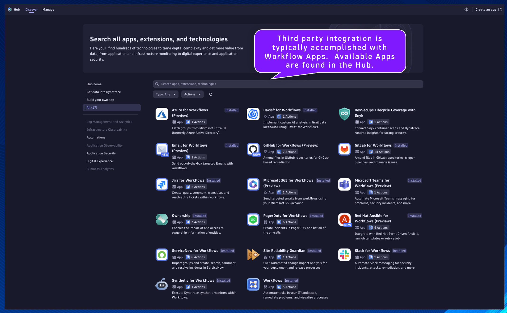

--8<-- "snippets/send-bizevent/2-getting-started.js"

## Third Party Integration

Goal: When a Davis problem event is triggered, send a problem summary as a Slack message to a chosen Slack channel.

- Event Trigger
    * Trigger Workflow when a Davis problem event is detected
    * Events are filtered on the type of event, based on the previous exercise
- Slack for Workflows
    * Third party integration is typically accomplished with Workflow Apps
    * The Slack for Workflows App provides an easy-to-use mechanism for sending messages to a Slack environment containing the data and context from Dynatrace
    * Leverage Jinja expressions to access Workflow action results and implement logic

### Slack for Workflows
Your Dynatrace environment can integrate with a Slack workspace using Slack for Workflows. You can automate sending messages to Slack based on the events and schedules defined for your workflow.

[Slack for Workflows Documentation](https://docs.dynatrace.com/docs/platform-modules/automations/workflows/actions/slack)

Setting up the Slack integration is straight forward and well documented.  In the interest of time and simplicity, the Slack integration has already been configured for this lab.

## Davis Problem Event Trigger

Begin by creating a new Workflow in the Workflows App within your Dynatrace environment.

*Remember to save progress often!*

Select a trigger: choose `Davis problem trigger`

Filter the events that will trigger this workflow.

Event state:
```
active or closed
```

Event category:
```
Custom
```

Affected entities:
```
include entities with all defined tagged below
```

Additional custom filter query:
```
matchesPhrase(event.name,"EasyTravel Journey Amount")
```


## Set Workflow Parameters

Click the `+` button to add a new action to the Workflow.

Choose action: choose `Run JavaScript` action type.


---
#### `js_set_parameters`
Name:
```text
js_set_parameters
```
Description:
```text
Set the parameters for this workflow
```

This will be the task/action that defines the parameters/variables that will be used by subsequent tasks and returns them in the result.  By setting the parameters as nested attribute key:value pairs within a single variable, as additional parameters are needed they can easily be added without modifying any other code.

Set the task name and description respectively.

Paste the following code snippet into the action `Input`:
```
export default async function () {

  let PARAMETERS = {

    // SLACK_CHANNEL - the Slack channel name (without the #) that the Slack bot has been added to
    SLACK_CHANNEL: "", // i.e. SLACK_CHANNEL: "workflow-essentials",
    
  }
  
  return PARAMETERS;
}
```

Set the value of the missing variables:
- SLACK_CHANNEL:
    * Use the channel name you have been provided (or have created)


## Slack Integration

#### `slack_send_message`
Name:
```text
slack_send_message
```
Description:
```text
Send problem summary in Slack
```

This will be the task/action that uses the Slack connection to send a problem summary message to a Slack channel.

Locate the `js_set_parameters` task.

Click the `+` button to add a new action to the Workflow.

Choose action: choose `Send message` action type from the Slack for Workflows section/app.


Set the task name and description respectively.

Configure the Send message action `Input`:

Connection:
```
workflow_essentials_demo
```
*This connection was created by the Workflow Essentials - Config Generator workflow*

Channel:
```
{{ result("js_set_parameters")['SLACK_CHANNEL'] }}
```

Message:
```
{
    "blocks": [
        {
            "type": "section",
            "block_id": "sectionHeader",
            "text": {
                "type": "mrkdwn",
                "text": "Dynatrace :dt: Problem Detection \n Workflow Execution: [{{ execution().id }}]"
            }
        },
        {
            "type": "divider"
        },
        {
            "type": "section",
            "block_id": "problemState",
            "text": {
                "type": "mrkdwn",
                "text": "Problem State:  :warning: OPEN :warning:   :white_check_mark: RESOLVED :white_check_mark: "
            }
        },
        {
            "type": "divider"
        },
        {
            "type": "section",
            "block_id": "problemSummary",
            "text": {
                "type": "mrkdwn",
                "text": "Problem Number: [*{{ event()['display_id'] }}*] \n Problem ID: [ {{ event()['event.id'] }} ] \n [ {{ event()['event.name'] }} ]"
            }
        },
        {
            "type": "divider"
        },
        {
            "type": "actions",
            "elements": [
                {
                    "type": "button",
                    "text": {
                        "type": "plain_text",
                        "text": "View Problem",
                        "emoji": true
                    },
                    "value": "problem",
                    "url": "{{ environment().url }}/ui/apps/dynatrace.classic.problems/#problems/problemdetails;pid={{ event()['event.id'] }}"
                },
                {
                    "type": "button",
                    "text": {
                        "type": "plain_text",
                        "text": "View Workflow Execution",
                        "emoji": true
                    },
                    "value": "workflow",
                    "url": "{{ environment().url }}/ui/apps/dynatrace.automations/executions/{{ execution().id }}"
                }
            ]
        }
    ]
}
```


Click on the task's `Conditions` tab.  Set the `Run this task if`: `js_set_parameters` is `success`

Additionally, we only want this task to run if the `SLACK_CHANNEL` parameter is defined in the previous task.  We can access the result using a Jinja expression:
```
1. {{ result("task_name") }}
2. {{ result("task_name")['result_attribute_name'] }}
3. {{ result("task_name")['result_attribute_name'] condition expression }}
```

[Expression Reference Documentation](https://docs.dynatrace.com/docs/platform-modules/automations/workflows/reference)

Set the `And custom condition was met`:
```
{{ result("js_set_parameters")['SLACK_CHANNEL'] is defined }}
```


## Trigger Workflow Execution

Open the Workflow Essentials - Ingest and Alert workflow from the previous exercise.  Run the workflow and validate the results.  A new problem event should have been created.


Shortly after running the other workflow, the Workflow Essentials - Slack Integration workflow should have triggered as a result of the problem event.  Check the execution and validate the results.  Open the Slack channel and validate that the message contains the problem summary.


Third party integrations are available as Workflow Action Apps, which are available in the Hub.



## Continue

In the next section, we'll launch our Codespaces instance.

<div class="grid cards" markdown>
- [Continue to Codespaces:octicons-arrow-right-24:](3-codespaces.md)
</div>
