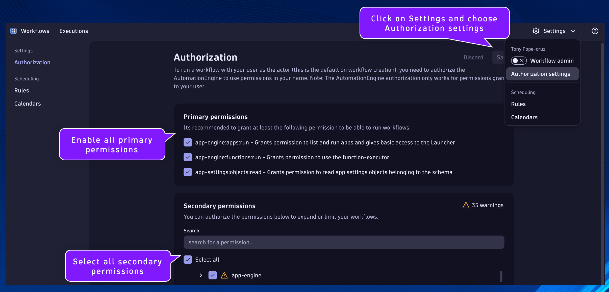
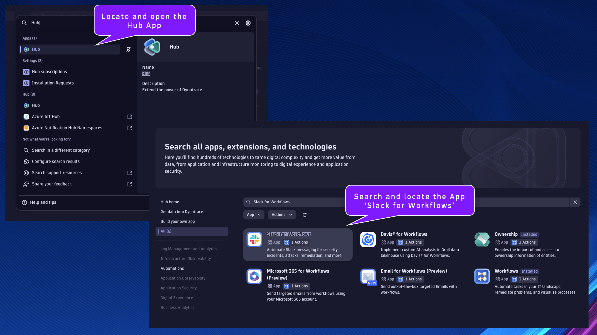
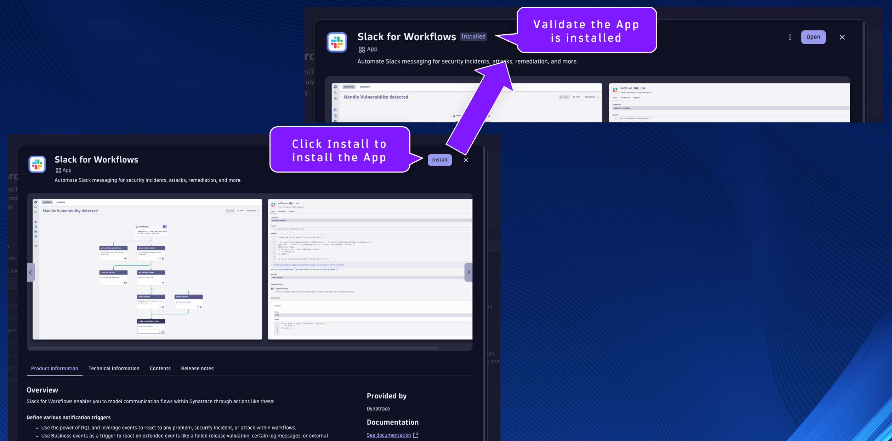
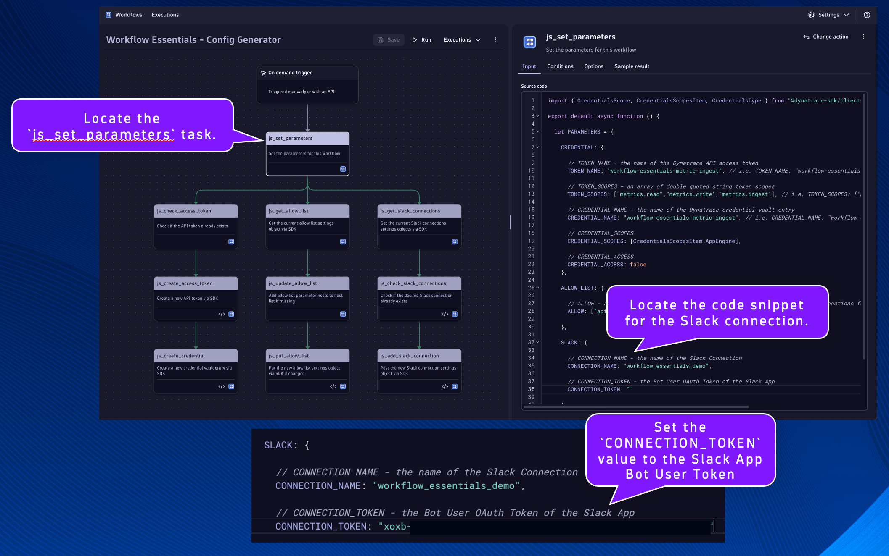
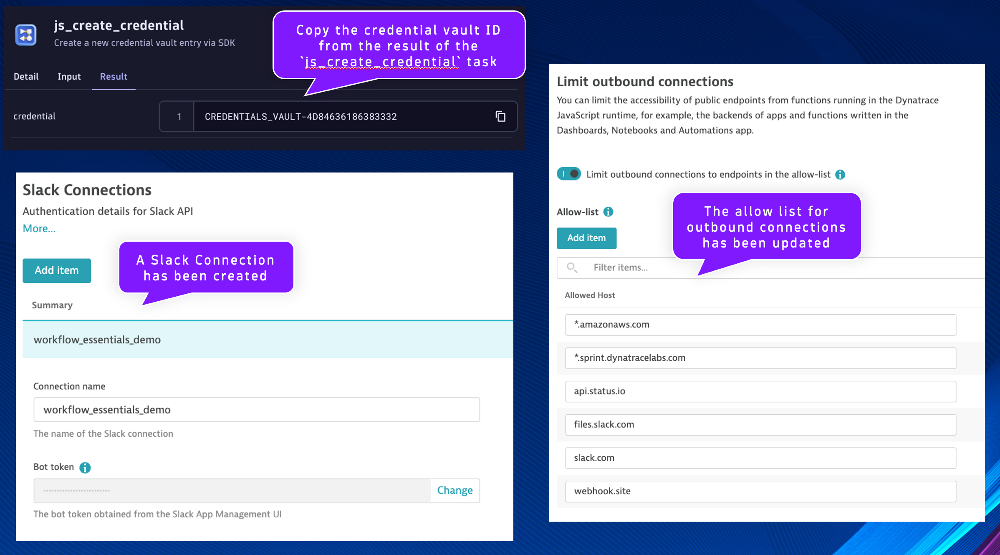
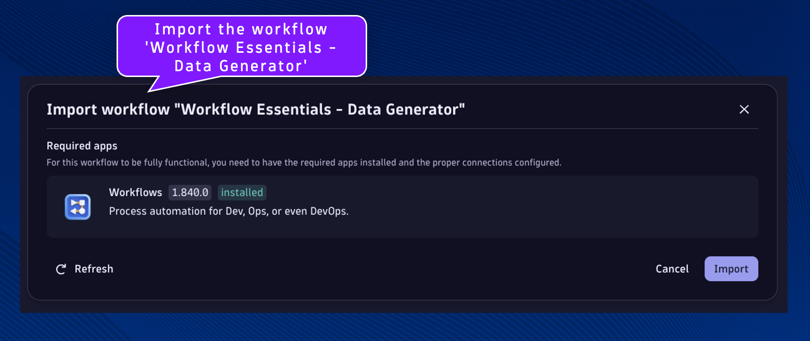
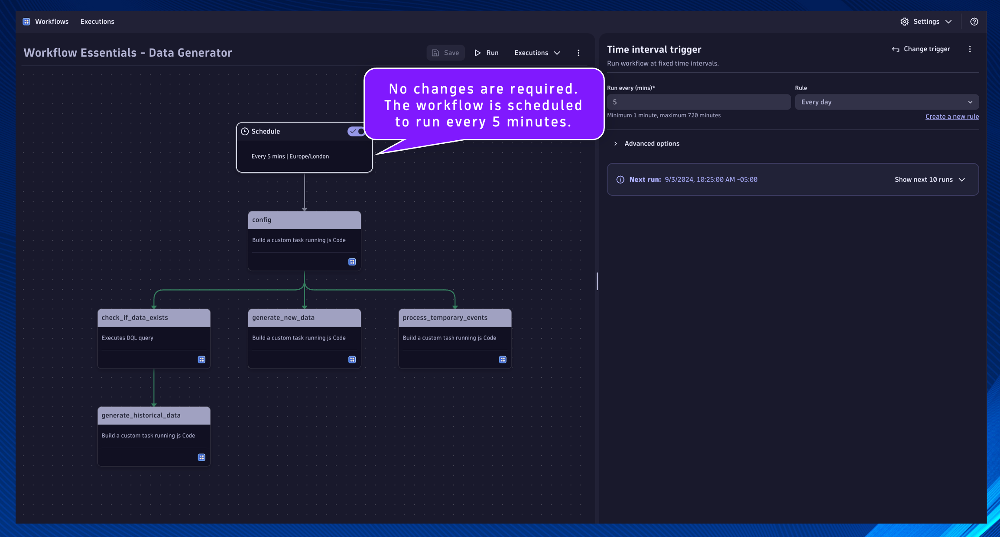

--8<-- "snippets/send-bizevent/2-getting-started.js"

--8<-- "snippets/requirements.md"

## Prerequisites

You will need full administrator access to a Dynatrace SaaS tenant with a DPS license.

* Workflow Settings - Authorization
* Slack for Workflows
* Config Generator
* Data Generator

### Workflow Settings - Authorization

To run a workflow with your user as the actor (this is the default on workflow creation), you need to authorize the AutomationEngine to use permissions in your name. Note: The AutomationEngine authorization only works for permissions granted to your user.

In your Dynatrace environment, open the Workflows App.

Validate that the following permissions are granted to workflow executions.

Primary permissions:

[ x ] app-engine:apps:run - Grants permission to list and run apps and gives basic access to the Launcher

[ x ] app-engine:functions:run - Grants permission to use the function-executor

[ x ] app-settings:objects:read - Grants permission to read app settings objects belonging to the schema

Secondary permissions:

[ x ] select all

### Slack for Workflows

In your Dynatrace environment, search, locate, and open the Hub App.

Search for the App `Slack` and click on it.  Note, it used to be called `Slack for Workflows`.

Click on Install to install the App into your environment.

Close any notification prompts if necessary.

Validate that the App was installed into your environment.

### Config Generator

In your Dynatrace environment, open the Workflows App.

Import the workflow 'Workflow Essentials - Config Generator' using the source file [Workflow Essentials - Config Generator](https://github.com/dynatrace-wwse/enablement-workflow-essentials/blob/main/lab-guide/assets/dt_wftpl_workflow_essentials_config_generator.yaml)

Workflows are imported using the Upload button.

Locate the `js_set_parameters` task.  Locate the code snippet for the Slack connection.

Set the `CONNECTION_TOKEN` value to the Slack App Bot User Token you have been provided (or have created).

Run the workflow and validate that it runs successfully.

As a result of the workflow, three configurations have been made to the Dynatrace environment:

1. A credential vault entry has been added containing a Dynatrace API token
    * Copy the credential vault ID from the result of the `js_create_credential` task and store it in your notes somewhere, it is needed in a future exercise
2. The allow list for outbound connections has been updated with the hosts/domains required for this lab
    * No action required, simply verify using screenshot below
3. A Slack Connection has been created called `workflow_essentials_demo`
    * No action required, simply verify using screenshot below

### Data Generator

In your Dynatrace environment, open the Workflows App.

Import the workflow 'Workflow Essentials - Data Generator' using the source file [Workflow Essentials - Data Generator](https://github.com/dynatrace-wwse/enablement-workflow-essentials/blob/main/lab-guide/assets/dt_wftpl_workflow_essentials_data_generator.yaml)

Workflows are imported using the Upload button.

No changes are required.  The workflow is scheduled to run every 5 minutes.

This workflow will generate bizevents representing a multi-stage business process.  This data will be used by the other workflows in the lab, removing the requirement to deploy OneAgents or ingest data through other mechanisms.

!!! warning "Write BizEvents Access"
    If the Workflow fails to generate BizEvents, indicated by HTTP 4XX errors in the action logs, then your account is likely missing the `storage:events:write` permission.  For more details, please see the documentation: [Business Analytics API - IAM Policy](https://docs.dynatrace.com/docs/observe/business-analytics/ba-api-ingest#iam-policy){target=_blank}

## Continue

In the next section, we'll utilize essential Workflow techniques.

- [Continue to Workflow Essentials:octicons-arrow-right-24:](03_workflow_essentials.md)

